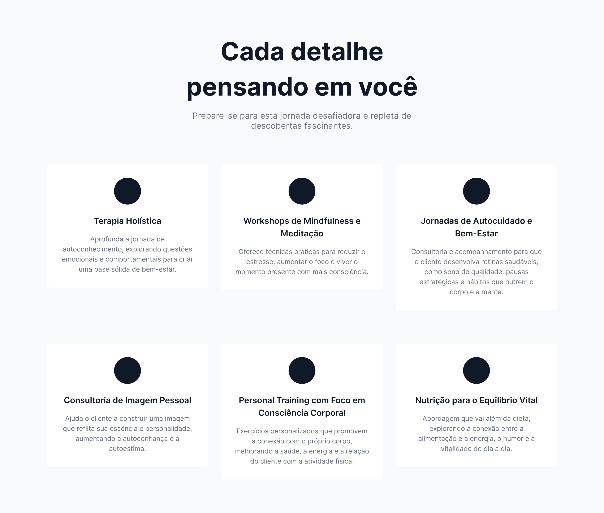
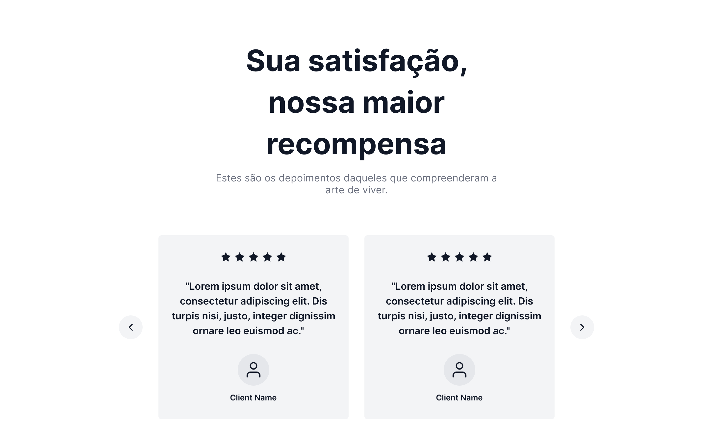
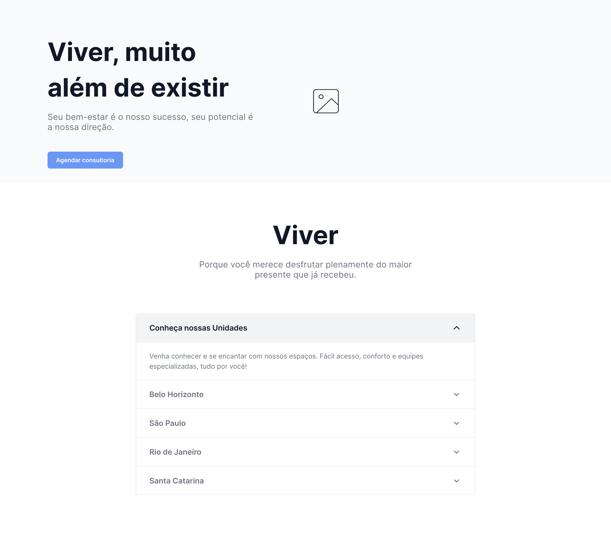

# Wireframe de Média Fidelidade - Curso de UX Designer (DIO.me)

Este repositório contém um wireframe de média fidelidade desenvolvido durante o curso de **UX Designer** da **DIO.me**.

O objetivo do exercício era aplicar boas práticas de design visual, organização de conteúdo e estruturação de páginas, simulando a proposta de um layout para uma futura aplicação web.

## 🔧 Ferramenta utilizada

- [Figma](https://www.figma.com) – ferramenta de design colaborativo e prototipação

## 🖼️ Prévia do wireframe

  

  

  

  

## 🔗 Acesse no Figma

Você também pode visualizar diretamente o protótipo no Figma por este link:

👉 [Visualizar no Figma](https://www.figma.com/community/file/1537200039508893784)

## 📌 Observações

- O projeto é uma entrega simples, com foco em **estrutura e usabilidade**.
- Pode servir de base para protótipos de páginas institucionais, portais de conteúdo ou até e-commerces.

---

## 👨‍💻 Expert

    
    
&nbsp&nbsp&nbspThaize Campos 
    &nbsp&nbsp&nbsp
    <a href="https://github.com/Thaizebmc/">
    GitHub</a>&nbsp;|&nbsp;
    <a href="https://www.linkedin.com/in/thaize-barbosa-mendes-campos-63b47427a/">LinkedIn</a>
&nbsp;|&nbsp;
    <a href="https://www.instagram.com/camposthaize/">
    Instagram</a>
&nbsp;|&nbsp;

  

---

⌨️ com 💜 por [Thaize Campos](https://github.com/Thaizebmc/)
